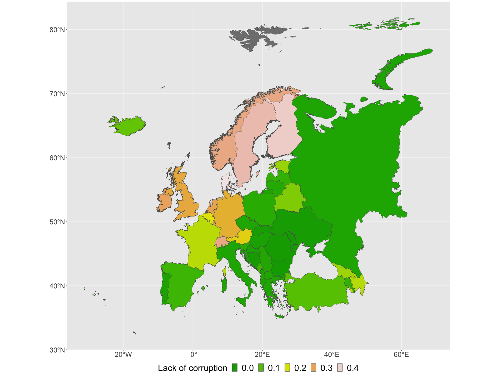

# Happiness report

The World Happiness Report is a landmark survey of the state of global happiness. The first report was published in 2012, the second in 2013, the third in 2015, and the fourth in the 2016 Update. The World Happiness 2017, which ranks 155 countries by their happiness levels, was released at the United Nations at an event celebrating International Day of Happiness on March 20th. The report continues to gain global recognition as governments, organizations and civil society increasingly use happiness indicators to inform their policy-making decisions. Leading experts across fields -- economics, psychology, survey analysis, national statistics, health, public policy and more -- describe how measurements of well-being can be used effectively to assess the progress of nations. The reports review the state of happiness in the world today and show how the new science of happiness explains personal and national variations in happiness. The original data can be found at <https://www.kaggle.com/datasets/unsdsn/world-happiness> wherein extra explanation regarding different studied components is also given.

### To see the below results as a single document see  [Happiness.pdf](https://github.com/moradimahtab/WorldHappiness/blob/main/Happiness.pdf)

Below, we provide some maps based on different items considered in the happiness report during 2019. Throughout, the R packages sf and ggplot2 are used. The happiness data is given as a csv file, and the maps of countries as shape files. We display maps for the entire world, europe, and south-america. 

Note: Countries appeared in grey are those we have no data for.

## World


```{r}
Happiness <- read.csv("2019.csv",sep = ";")
head(Happiness)
```

```{r,warning=FALSE,message=FALSE}
library(sf)
```

```{r}
World <- read_sf("World_Countries.shp")
head(World)
```

There are some countries in the maps which are not included in the happiness report, below we extract the list of such countries.

```{r}
World$COUNTRY[!World$COUNTRY %in% Happiness$Country.or.region]
```

Below we extract the happiness data corresponding to different countries, and for those countries which there is no data, we set NA.

```{r}
Happ_World <- Happiness[Happiness$Country.or.region %in% World$COUNTRY[
  World$COUNTRY %in% Happiness$Country.or.region],]
NA_rows <- as.data.frame(matrix(NA,nrow=13,ncol=9))
names(NA_rows) <- names(Happ_World)
Happ_World <- rbind(Happ_World,NA_rows)
```

Next, we merge the happiness data to our map of the world.

```{r}
World_happ <- cbind(World,Happ_World[match(World$COUNTRY,Happ_World$Country.or.region),])
```

There were few countries which their names were written in different ways in the two sources of data, i.e. world map and happiness data.  Below, we update the rows corresponding to such countries. 

```{r}
World_happ[World_happ$COUNTRY=="Trinidad & Tobago",] <- cbind(World_happ[
  World_happ$COUNTRY=="Trinidad & Tobago",1],Happiness[
    Happiness$Country.or.region=="Trinidad and Tobago",])
World_happ[World_happ$COUNTRY=="Macedonia",] <- cbind(World_happ[
  World_happ$COUNTRY=="Macedonia",1],Happiness[
    Happiness$Country.or.region=="North Macedonia",])
World_happ[World_happ$COUNTRY=="Congo",] <- cbind(World_happ[
  World_happ$COUNTRY=="Congo",1],Happiness[
    Happiness$Country.or.region=="Congo (Brazzaville)",])

```

We now display different maps using ggplot2 package in which colours stand for the values of studied items.

#### Happniess score

```{r}
library(ggplot2)
ggplot(World_happ) +
  geom_sf(aes(fill = Score)) +
  theme(axis.title.x = element_blank(),
          axis.title.y = element_blank(),
        legend.position="bottom",
        legend.title=element_text(size=28), 
        legend.text=element_text(size=28))+
  scale_fill_gradientn(colours = terrain.colors(100),limits=c(2.7,7.7))+
  guides(fill=guide_legend(title="Happiness score"))
```


####  GDP per capita

```{r}
library(ggplot2)
ggplot(World_happ) +
  geom_sf(aes(fill = GDP.per.capita)) +
  theme(axis.title.x = element_blank(),
          axis.title.y = element_blank(),
        legend.position="bottom",
        legend.title=element_text(size=28), 
        legend.text=element_text(size=28))+   
  scale_fill_gradientn(colours = terrain.colors(100),limits=c(0,1.7))+
  guides(fill=guide_legend(title="GDP"))
```


#### Social support

```{r}
ggplot(World_happ) +
  geom_sf(aes(fill = Social.support)) +
  theme(axis.title.x = element_blank(),
          axis.title.y = element_blank(),
        legend.position="bottom",
        legend.title=element_text(size=28), 
        legend.text=element_text(size=28))+   
  scale_fill_gradientn(colours = terrain.colors(100),limits=c(0,1.7))+
  guides(fill=guide_legend(title="Social support"))
```


#### Life expectancy

```{r}
ggplot(World_happ) +
  geom_sf(aes(fill = Healthy.life.expectancy)) +
  theme(axis.title.x = element_blank(),
          axis.title.y = element_blank(),
        legend.position="bottom",
        legend.title=element_text(size=28), 
        legend.text=element_text(size=28))+ 
  scale_fill_gradientn(colours = terrain.colors(100),limits=c(0,1.2))+
  guides(fill=guide_legend(title="Life expectancy"))
```


#### Freedom 

```{r}
ggplot(World_happ) +
  geom_sf(aes(fill = Freedom.to.make.life.choices)) +
  theme(axis.title.x = element_blank(),
          axis.title.y = element_blank(),
        legend.position="bottom",
        legend.title=element_text(size=28), 
        legend.text=element_text(size=28))+ 
  scale_fill_gradientn(colours = terrain.colors(100),limits=c(0,0.7))+
  guides(fill=guide_legend(title="Freedom"))
```


##### Generosity

```{r}
ggplot(World_happ) +
  geom_sf(aes(fill = Generosity)) +
  theme(axis.title.x = element_blank(),
          axis.title.y = element_blank(),
        legend.position="bottom",
        legend.title=element_text(size=28), 
        legend.text=element_text(size=28))+
  scale_fill_gradientn(colours = terrain.colors(100),limits=c(0,0.6))+
  guides(fill=guide_legend(title="Generosity"))
```


##### Lack of corruption

```{r}
ggplot(World_happ) +
  geom_sf(aes(fill = Perceptions.of.corruption)) +
  theme(axis.title.x = element_blank(),
          axis.title.y = element_blank(),
        legend.position="bottom",
        legend.title=element_text(size=28), 
        legend.text=element_text(size=28))+ 
  scale_fill_gradientn(colours = terrain.colors(100),limits=c(0,0.5))+
  guides(fill=guide_legend(title="Lack of corruption"))
```


## Europe

```{r}
EU <- read_sf("Europe.shp")
head(EU)
```

```{r}
Happ_eu <- Happiness[Happiness$Country.or.region %in% EU$NAME[
  EU$NAME %in% Happiness$Country.or.region],]
NA_rows <- as.data.frame(matrix(NA,nrow=13,ncol=9))
names(NA_rows) <- names(Happ_eu)
Happ_eu <- rbind(Happ_eu,NA_rows)
```

```{r}
EU_happ <- cbind(EU,Happ_eu[match(EU$NAME,Happ_eu$Country.or.region),])
```

```{r}
EU_happ[EU_happ$NAME=="Bosnia Herzegovina",] <- cbind(EU_happ[
  EU_happ$NAME=="Bosnia Herzegovina",c(1:2)],Happiness[
    Happiness$Country.or.region=="Bosnia and Herzegovina",])
EU_happ[EU_happ$NAME=="Macedonia",] <- cbind(EU_happ[
  EU_happ$NAME=="Macedonia",c(1:2)],Happiness[
    Happiness$Country.or.region=="North Macedonia",])
```

#### Happniess score

```{r}
ggplot(EU_happ) +
  geom_sf(aes(fill = Score)) +
  theme(axis.title.x = element_blank(),
        axis.title.y = element_blank(),
        legend.position="bottom",
        legend.title=element_text(size=28), 
        legend.text=element_text(size=28),
        text = element_text(size = 28))+
  scale_fill_gradientn(colours = terrain.colors(100),limits=c(4.2,8))+
    guides(fill=guide_legend(title="Happiness score"))
```


#### GDP per capita

```{r}
ggplot(EU_happ) +
  geom_sf(aes(fill = GDP.per.capita)) +
  theme(axis.title.x = element_blank(),
        axis.title.y = element_blank(),
        legend.position="bottom",
        legend.title=element_text(size=28), 
        legend.text=element_text(size=28),
        text = element_text(size = 28))+
  scale_fill_gradientn(colours = terrain.colors(100),limits=c(0.5,1.8))+
  guides(fill=guide_legend(title="GDP"))
```


#### Social support

```{r}
ggplot(EU_happ) +
  geom_sf(aes(fill = Social.support)) +
  theme(axis.title.x = element_blank(),
        axis.title.y = element_blank(),
        legend.position="bottom",
        legend.title=element_text(size=28), 
        legend.text=element_text(size=28),
        text = element_text(size = 28))+
  scale_fill_gradientn(colours = terrain.colors(100),limits=c(0.6,1.7))+
  guides(fill=guide_legend(title="Social support"))
```


#### Life expectancy

```{r}
ggplot(EU_happ) +
  geom_sf(aes(fill = Healthy.life.expectancy)) +
  theme(axis.title.x = element_blank(),
        axis.title.y = element_blank(),
        legend.position="bottom",
        legend.title=element_text(size=28), 
        legend.text=element_text(size=28),
        text = element_text(size = 28))+
  scale_fill_gradientn(colours = terrain.colors(100),limits=c(0.7,1.1))+
  guides(fill=guide_legend(title="Life expectancy"))
```


#### Freedom

```{r}
ggplot(EU_happ) +
  geom_sf(aes(fill = Freedom.to.make.life.choices)) +
  theme(axis.title.x = element_blank(),
        axis.title.y = element_blank(),
        legend.position="bottom",
        legend.title=element_text(size=28), 
        legend.text=element_text(size=28),
        text = element_text(size = 28))+
  scale_fill_gradientn(colours = terrain.colors(100),limits=c(0.05,0.65))+
  guides(fill=guide_legend(title="Freedom"))
```


#### Generosity

```{r}
ggplot(EU_happ) +
  geom_sf(aes(fill = Generosity)) +
  theme(axis.title.x = element_blank(),
        axis.title.y = element_blank(),
        legend.position="bottom",
        legend.title=element_text(size=28), 
        legend.text=element_text(size=28),
        text = element_text(size = 28))+
  scale_fill_gradientn(colours = terrain.colors(100),limits=c(0,0.4))+
  guides(fill=guide_legend(title="Generosity"))
```


#### Lack of corruption

```{r}
ggplot(EU_happ) +
  geom_sf(aes(fill = Perceptions.of.corruption)) +
  theme(axis.title.x = element_blank(),
        axis.title.y = element_blank(),
        legend.position="bottom",
        legend.title=element_text(size=28), 
        legend.text=element_text(size=28),
        text = element_text(size = 28))+
  scale_fill_gradientn(colours = terrain.colors(100),limits=c(0,0.42))+
  guides(fill=guide_legend(title="Lack of corruption"))
```

